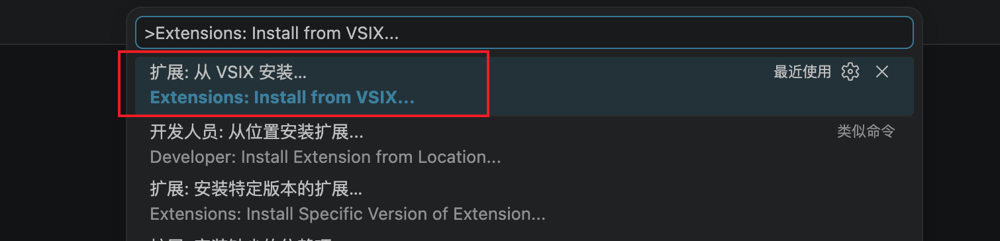
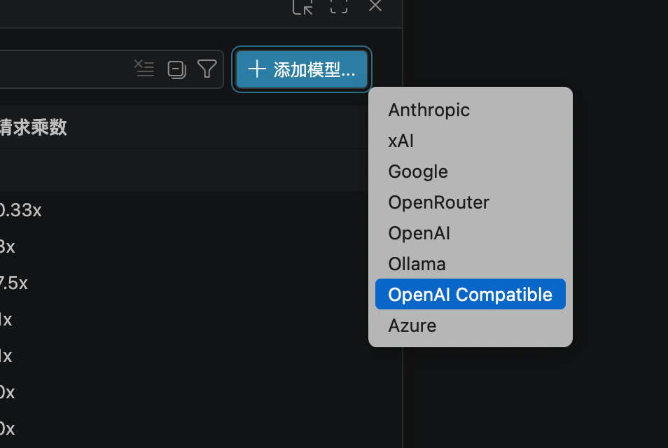
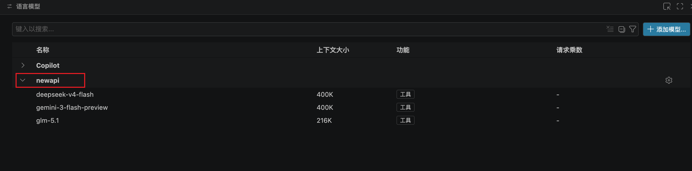
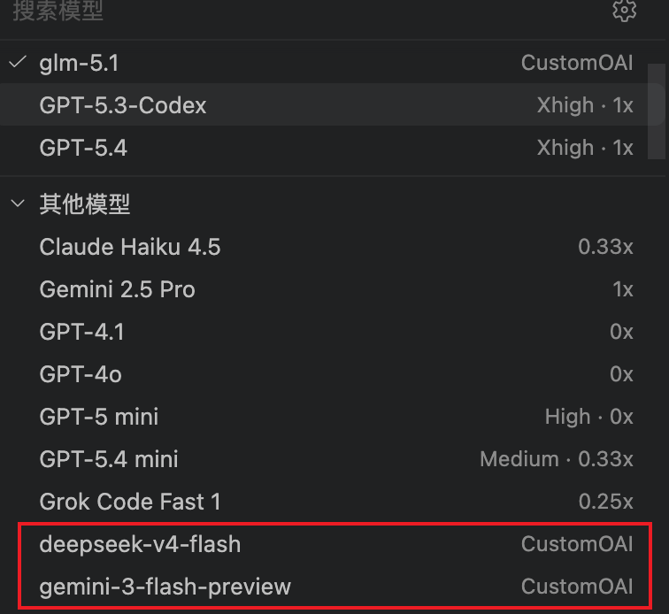

# 启用 Copilot CustomOAI

[English](README.md) | [中文](README_zh.md)

一个极简 VS Code 扩展，在 VS Code 稳定版中为 **GitHub Copilot Chat** 解锁 **OpenAI Compatible (CustomOAI)** 模型提供者。

## 前置条件

- 必须已安装 **[GitHub Copilot Chat](https://marketplace.visualstudio.com/items?itemName=GitHub.copilot-chat)** 扩展。本扩展仅解锁 Copilot Chat 中隐藏的提供者，无法独立使用。

## 它做了什么

VS Code Copilot Chat 内置了一个 "CustomOAI" 提供者，可以连接任何 OpenAI 兼容的 API（如本地推理服务、第三方 LLM 提供商）。但该提供者被 `productQualityType != 'stable'` 条件限制，只在 VS Code Insiders 中可见。

本扩展在启动时将 `productQualityType` 设为 `insiders`，使 CustomOAI 提供者出现在模型选择器中。

仅此而已。一行有效代码。

## 安装

### 方法一：VS Code 界面安装

1. 从 [Releases](../../releases) 下载 `.vsix` 文件
2. 打开 VS Code → 按 `Ctrl+Shift+P` / `Cmd+Shift+P`
3. 输入 `Extensions: Install from VSIX...` 并选择下载的文件
4. 重启 VS Code



### 方法二：命令行安装

1. 从 [Releases](../../releases) 下载 `.vsix` 文件
2. 执行：`code --install-extension enable-copilot-customoai-0.0.1.vsix`
3. 重启 VS Code

## 使用方法

1. 安装后重启 VS Code
2. 打开 Copilot Chat → 点击模型选择器
3. 选择 "OpenAI Compatible" 提供者



4. 配置你的 API 端点和模型





## 工作原理

```js
vscode.commands.executeCommand('setContext', 'productQualityType', 'insiders');
```

设置 VS Code 上下文变量，使 Copilot Chat 的 `languageModelChatProviders` 贡献点中 `when` 条件成立：

```json
"when": "productQualityType != 'stable'"
```

## 常见配置示例

连接本地 New API / One API 等兼容服务：

```json
[
  {
    "name": "my-api",
    "vendor": "customoai",
    "apiKey": "sk-your-api-key",
    "models": [
      {
        "id": "gpt-4o",
        "name": "GPT-4o",
        "url": "https://api.example.com/v1/chat/completions",
        "toolCalling": true,
        "vision": true,
        "maxInputTokens": 128000,
        "maxOutputTokens": 16000
      }
    ]
  }
]
```

URL 填写规则：
- 域名：`https://api.example.com` → 自动补全为 `/v1/chat/completions`
- 带版本：`https://api.example.com/v1` → 自动补全为 `/chat/completions`
- 完整路径：`https://api.example.com/v1/chat/completions` → 原样使用

## 免责声明

本扩展修改了 VS Code 内部上下文变量。如果微软在后续版本中移除或重命名该变量，扩展将失效。

## 许可证

MIT